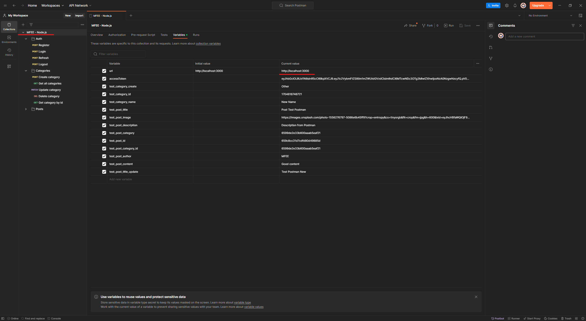
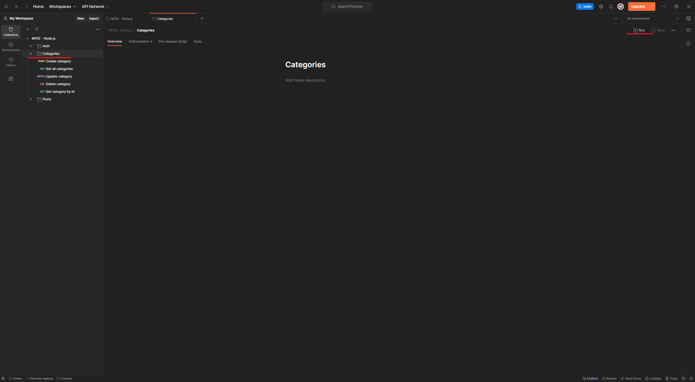
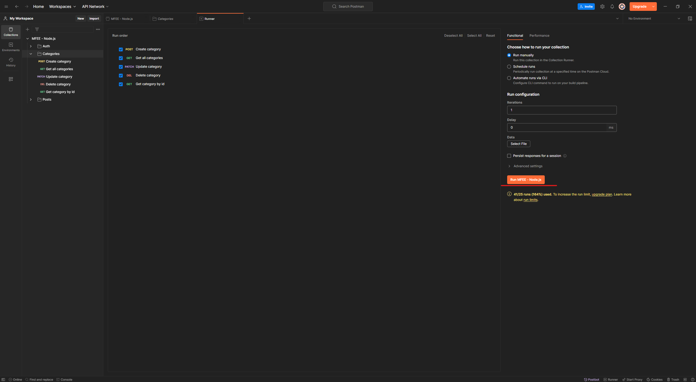
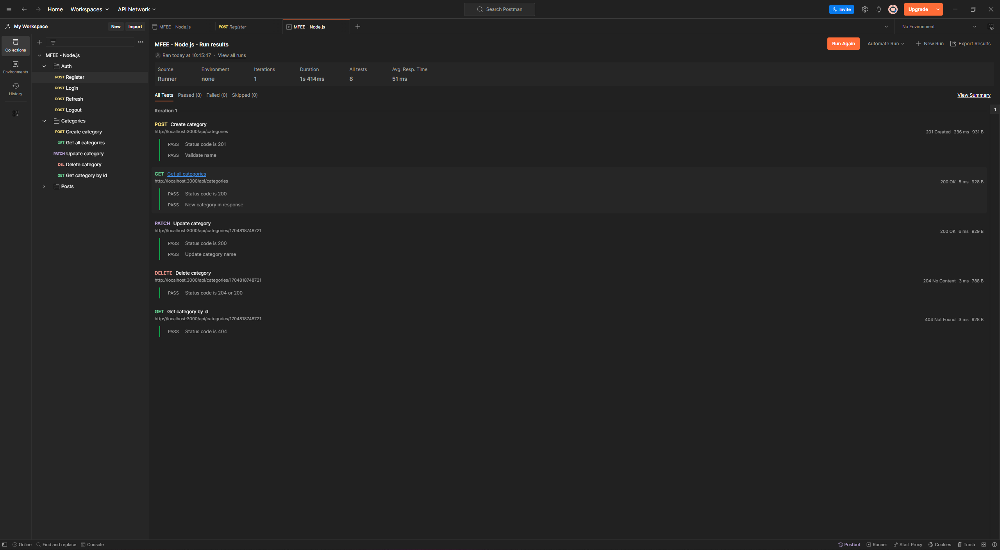
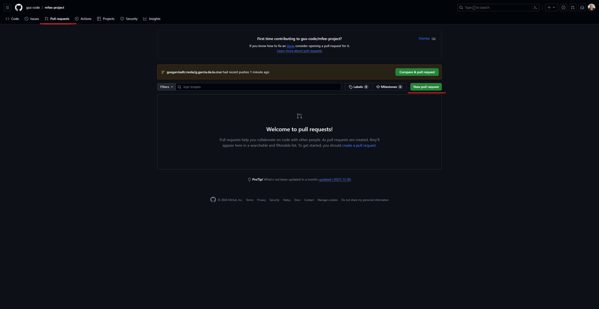
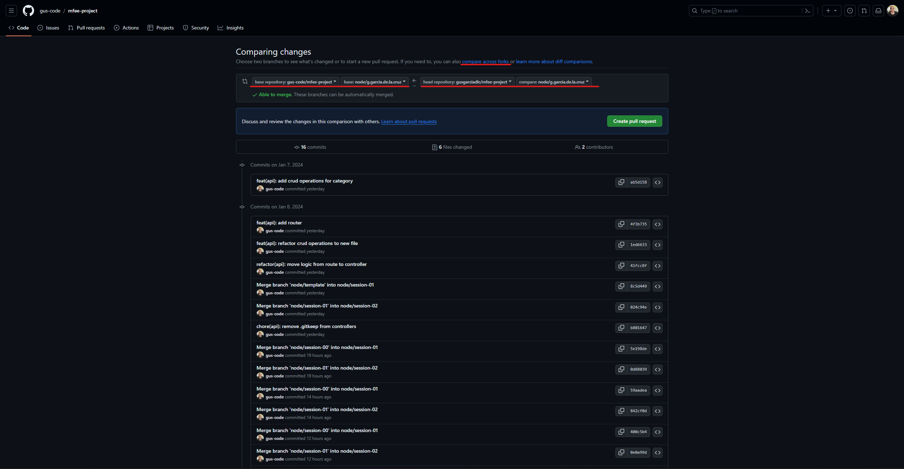
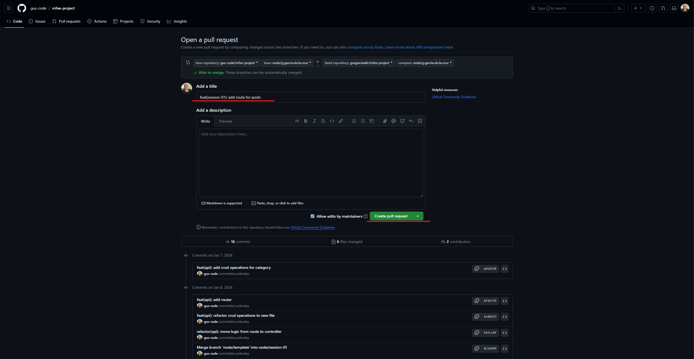

# Node.js Express API

## Instructions

1. Fork [mfee-project repository](https://github.com/gus-code/mfee-project)
2. Make sure to fork all the branches (You need to unselect the checkbox of fork only main branch)
3. You can clone the repository to your local or you can create a codespace in github (We suggest to use your local because we will use postman to test it)
4. Checkout to branch `node/template` this is the starter boilerplate
    - `git checkout node/template`
5. From here you can create your own branch (We suggest to name it `node/<your_eid_here>`)
    - `git checkout -b node/<your_eid_here>`
6. We will be working with some examples during the sessions in this same repository, once we finish with the session you can get the example from the branch `node/session-*` and merge it to your branch (We will provide the branch after each session)
    - `git merge node/session-*`
7. Each session branch will have the challenges to accomplish and the expected results. You can validate if your endpoint is correct by [running the postman collection](#run-postman-collection)
8. After finish the challenges you need to create a pull request to the base repository, you will have a branch with your EID (`node/<your_eid_here>`). If you don't know how to do it you can check this [quick guide](#create-pull-request)

## Recommendations

- Use [conventional commits](https://www.conventionalcommits.org/en/v1.0.0/)
- Before make your commit format your files with prettier

## Challenges

### Session *

## How to

### Run postman collection

1. Download postman collection from `apps/api/src/assets/mfee-node.postman_collection.json`
2. Import collection to postman
3. Configure url variable if needed. We set the default value to `http://localhost:3000` if you change the port you will need to update this, after updating the value you need to save it with `Ctrl + S`

4. Once everything is in place you go to the folder you want to run and click "Run"

5. The endpoints will be displayed and you just need to click on "Run MFEE - Node.js"

6. After this a report will be show and all the test should pass

### Create pull request

1. Once you have your commit in place and you push your branch to your forked repository go to `Pull requests` option and then `Create pull request`

2. Click under `compare across forks` to be able to select the main repository and make sure to select the following
    - Base repository: `gus-code/mfee-project`
    - Base: `node/<your-eid-here>`
    - Head repository: `<your-github-user>/mfee-project`
    - Compare: `<your-branch-name>`
    
    
3. Check that the files you worked on are in place and then click `Create pull request`
4. Add the title with the following format `feat(session-*): <small-title-of-changes>` where * is the number of the session (01, 02, etc.). After that click again on `Create pull request`

5. After this we will review the PR, give feedback and merge it to your branch